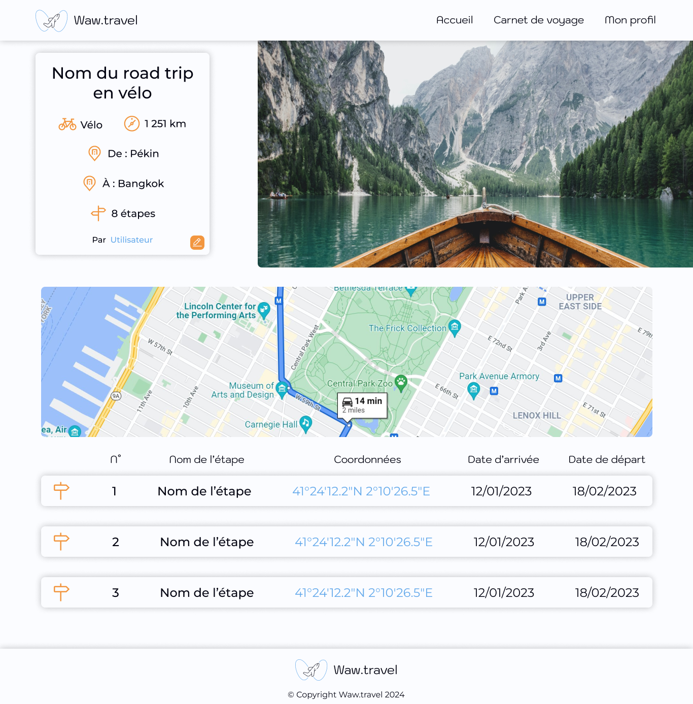

# Waw.travel

Waw.travel est une plateforme communautaire gratuite permettant aux voyageurs de partager leurs road trips avec leur famille et leurs amis via une page web publique.

---

## Fonctionnalités

1. Authentification
2. Gestion des road trips

- Un road trip est défini par :
  - `Intitulé` : Nom du road trip.
  - `Type de véhicule` : Par exemple, moto, van, voiture.
- `Checkpoints` :
 Chaque road trip inclut au moins deux checkpoints (départ et arrivée)
  - `Nom du spot` : Identifiant descriptif du lieu.
  - `Coordonnées Google Maps` : données GPS pour localisation.
  - `Dates d'arrivée et de départ` : Pour chaque checkpoint.

3. Page publique du road trip

- Une URL unique pour chaque road trip : <https://waw.travel/{id-voyage}>.
- Présentation détaillée incluant les informations des checkpoints.
- API Google Maps : Calcul et affichage de la distance totale du trajet.
- Image de couverture : Permet de personnaliser la page publique du road trip.

---

## Installation

**Installez et configurez le framework PHP [Plugo](PLUGO.md)**

---

### Aperçu du projet

### Page d'accueil

### Page de présentation d'un road trip

### Page de connexion

### Page d'inscription

### Page de liste des road trips

### Page de création d'un road trip

### Page de profil

